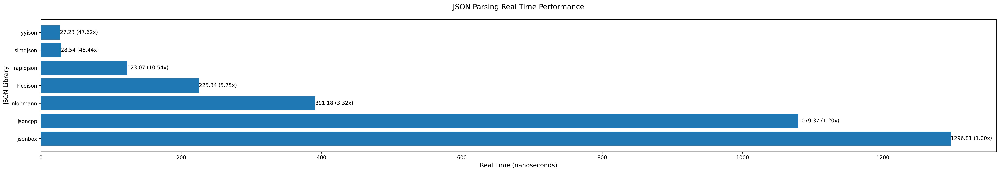

# JSON Libraries in Cpp Benchmark

Here is comparsive results of benchmarking json libraries in C++.

# Parameters and Indexes

These parameters will define the test environment and conditions:

1. Libraries to Compare
* yyjson
* simdjson
* RapidJSON
* sajson
* nlohmann/json (for a non-SIMD baseline)
* Jansson (optional, for completeness)

2. Test Cases (Workloads)
* Small JSON Parsing: (~1 KB JSON, simple objects)
* Large JSON Parsing: (~1 MB JSON, deeply nested objects & arrays)
* Streaming JSON Parsing: (incremental parsing of large JSON)
* Serialization Speed: (convert structured data to JSON)
* Memory Usage: (track memory allocations during parsing)

3. JSON Structure Types:

* Flat JSON:
```json
{
    "key": "value",
    "num": 123
}
```

* Nested JSON:
```json
{
    "parent":
    {
        "child":
        {
            "value": 123
        }
    }
}
```

* Array-heavy JSON:
``` json
{
    "list":
    [
        1, 
        2, 
        3, 
        ..., 
        10000
    ]
}
```

* Mixed JSON
   A mix of objects, arrays, and nested elements.

We will measure the following metrics for each test case:

1. Parsing Speed 
   * Time taken to parse JSON into memory.
   * Measured in megabytes per second (MB/s).
2. Serialization Speed
   * Time taken to convert structured data into a JSON string.
   * Measured in megabytes per second (MB/s).
3. Memory Usage
   * Peak and average memory consumption.
   * Measured in megabytes (MB).
4. CPU Utilization
   * How much CPU time is used during parsing.
   * Measured in percentile (%).
5. Allocation Count
   * Helps determine the memory efficiency of each library.
   * Measured in malloc/free calls
6. Correctness
   * Ensures that all libraries produce the same output.

# Results

## Overall Scoring


## Parsing Speed




## Serialization Speed


## Memory Usage

